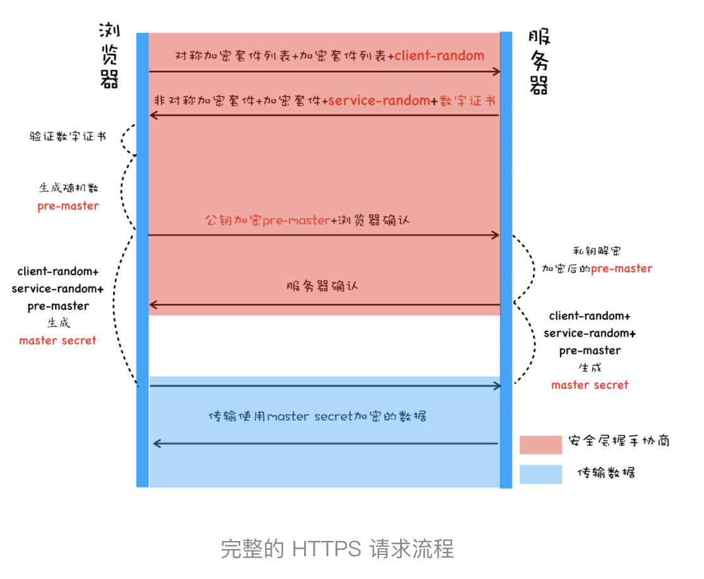

# 正文

## 同源策略：为什么XMLHttpRequest不能跨域请求资源

### 什么是同源策略

如果两个 URL 的协议、域名和端口都相同，我们就称这两个 URL 同源。比如下面这两个 URL，它们具有相同的协议 HTTPS、相同的域名 time.geekbang.org，以及相同的端口 443，所以我们就说这两个 URL 是同源的。

```()
https://time.geekbang.org/?category=1
https://time.geekbang.org/?category=0
```

浏览器默认两个相同的源之间是可以相互访问资源和操作 DOM 的。两个不同的源之间若想要相互访问资源或者操作 DOM，那么会有一套基础的安全策略的制约，我们把这称为同源策略。

同源策略主要表现在 DOM、Web 数据和网络这三个层面。

1. 第一个，DOM 层面。同源策略限制了来自不同源的 JavaScript 脚本对当前 DOM 对象读和写的操作。

2. 第二个，数据层面。同源策略限制了不同源的站点读取当前站点的 Cookie、IndexDB、LocalStorage 等数据。由于同源策略，我们依然无法通过第二个页面的 opener 来访问第一个页面中的 Cookie、IndexDB 或者 LocalStorage 等内容。你可以自己试一下，这里我们就不做演示了。

3. 网络层面。同源策略限制了通过 XMLHttpRequest 等方式将站点的数据发送给不同源的站点

### CSP

浏览器中引入了内容安全策略，称为 CSP。CSP 的核心思想是让服务器决定浏览器能够加载哪些资源，让服务器决定浏览器是否能够执行内联 JavaScript 代码。通过这些手段就可以大大减少 XSS 攻击

### CORS

默认情况下，如果打开极客邦的官网页面，在官网页面中通过 XMLHttpRequest 或者 Fetch 来请求 InfoQ 中的资源，这时同源策略会阻止其向 InfoQ 发出请求，这样会大大制约我们的生产力。为了解决这个问题，我们引入了跨域资源共享（CORS），使用该机制可以进行跨域访问控制，从而使跨域数据传输得以安全进行。

在介绍同源策略时，我们说明了如果两个页面不是同源的，则无法相互操纵 DOM。不过在实际应用中，经常需要两个不同源的 DOM 之间进行通信，于是浏览器中又引入了跨文档消息机制，可以通过 window.postMessage 的 JavaScript 接口来和不同源的 DOM 进行通信。

## 跨站脚本攻击（XSS）：为什么Cookie中有HttpOnly属性

### 什么是 XSS 攻击

XSS 全称是 Cross Site Scripting，为了与“CSS”区分开来，故简称 XSS，翻译过来就是“跨站脚本”。XSS 攻击是指黑客往 HTML 文件中或者 DOM 中注入恶意脚本，从而在用户浏览页面时利用注入的恶意脚本对用户实施攻击的一种手段。

### 恶意脚本是怎么注入的

1. 存储型 XSS 攻击
    

    我们可以看出存储型 XSS 攻击大致需要经过如下步骤：首先黑客利用站点漏洞将一段恶意 JavaScript 代码提交到网站的数据库中；然后用户向网站请求包含了恶意 JavaScript 脚本的页面；当用户浏览该页面的时候，恶意脚本就会将用户的 Cookie 信息等数据上传到服务器。

2. 反射型 XSS 攻击
    在一个反射型 XSS 攻击过程中，恶意 JavaScript 脚本属于用户发送给网站请求中的一部分，随后网站又把恶意 JavaScript 脚本返回给用户。当恶意 JavaScript 脚本在用户页面中被执行时，黑客就可以利用该脚本做一些恶意操作。

    另外需要注意的是，Web 服务器不会存储反射型 XSS 攻击的恶意脚本，这是和存储型 XSS 攻击不同的地方。

3. 基于 DOM 的 XSS 攻击
    基于 DOM 的 XSS 攻击是不牵涉到页面 Web 服务器的。具体来讲，黑客通过各种手段将恶意脚本注入用户的页面中，比如通过网络劫持在页面传输过程中修改 HTML 页面的内容，这种劫持类型很多，有通过 WiFi 路由器劫持的，有通过本地恶意软件来劫持的，它们的共同点是在 Web 资源传输过程或者在用户使用页面的过程中修改 Web 页面的数据。

### 如何阻止 XSS 攻击

1. 服务器对输入脚本进行过滤或转码不管是反射型还是存储型 XSS 攻击，我们都可以在服务器端将一些关键的字符进行转码，或者过滤

2. 充分利用 CSP

3. 使用 HttpOnly 属性

    由于很多 XSS 攻击都是来盗用 Cookie 的，因此还可以通过使用 HttpOnly 属性来保护我们 Cookie 的安全。通常服务器可以将某些 Cookie 设置为 HttpOnly 标志，HttpOnly 是服务器通过 HTTP 响应头来设置的

## CSRF攻击：陌生链接不要随便点

### 什么是 CSRF 攻击

CSRF 英文全称是 Cross-site request forgery，所以又称为“跨站请求伪造”，是指黑客引诱用户打开黑客的网站，在黑客的网站中，利用用户的登录状态发起的跨站请求。简单来讲，CSRF 攻击就是黑客利用了用户的登录状态，并通过第三方的站点来做一些坏事。

通常当用户打开了黑客的页面后，黑客有三种方式去实施 CSRF 攻击。

1. 自动发起 Get 请求

2. 自动发起 POST 请求

3. 引诱用户点击链接

和 XSS 不同的是，CSRF 攻击不需要将恶意代码注入用户的页面，仅仅是利用服务器的漏洞和用户的登录状态来实施攻击。

### 如何防止 CSRF 攻击

发起 CSRF 攻击的三个必要条件：

1. 第一个，目标站点一定要有 CSRF 漏洞；
2. 第二个，用户要登录过目标站点，并且在浏览器上保持有该站点的登录状态；
3. 第三个，需要用户打开一个第三方站点，可以是黑客的站点，也可以是一些论坛。

对于 CSRF 攻击我们主要的防护手段是提升服务器的安全性。

要让服务器避免遭受到 CSRF 攻击，通常有以下几种途径。

1. 充分利用好 Cookie 的 SameSite 属性
    SameSite 选项通常有 Strict、Lax 和 None 三个值。

    - Strict 最为严格。如果 SameSite 的值是 Strict，那么浏览器会完全禁止第三方 Cookie。简言之，如果你从极客时间的页面中访问 InfoQ 的资源，而 InfoQ 的某些 Cookie 设置了 SameSite = Strict 的话，那么这些 Cookie 是不会被发送到 InfoQ 的服务器上的。只有你从 InfoQ 的站点去请求 InfoQ 的资源时，才会带上这些 Cookie。
    - Lax 相对宽松一点。在跨站点的情况下，从第三方站点的链接打开和从第三方站点提交 Get 方式的表单这两种方式都会携带 Cookie。但如果在第三方站点中使用 Post 方法，或者通过 img、iframe 等标签加载的 URL，这些场景都不会携带 Cookie。
    - 而如果使用 None 的话，在任何情况下都会发送 Cookie 数据。

2. 验证请求的来源站点
    在服务器端验证请求来源的站点。

    由于 CSRF 攻击大多来自于第三方站点，因此服务器可以禁止来自第三方站点的请求。

    那么该怎么判断请求是否来自第三方站点呢？这就需要介绍 HTTP 请求头中的 Referer 和 Origin 属性了。

    Referer 是 HTTP 请求头中的一个字段，记录了该 HTTP 请求的来源地址

    但在服务器端验证请求头中的 Referer 并不是太可靠，因此标准委员会又制定了 Origin 属性，在一些重要的场合，比如通过 XMLHttpRequest、Fecth 发起跨站请求或者通过 Post 方法发送请求时，都会带上 Origin 属性

    Origin 属性只包含了域名信息，并没有包含具体的 URL 路径，这是 Origin 和 Referer 的一个主要区别。

3. CSRF Token

    - 第一步，在浏览器向服务器发起请求时，服务器生成一个 CSRF Token。CSRF Token 其实就是服务器生成的字符串，然后将该字符串植入到返回的页面中。你可以参考下面示例代码：
    - 第二步，在浏览器端如果要发起转账的请求，那么需要带上页面中的 CSRF Token，然后服务器会验证该 Token 是否合法。如果是从第三方站点发出的请求，那么将无法获取到 CSRF Token 的值，所以即使发出了请求，服务器也会因为 CSRF Token 不正确而拒绝请求。

## 安全沙箱：页面和系统之间的隔离墙

将渲染进程和操作系统隔离的这道墙就是我们要聊的安全沙箱。

浏览器中的安全沙箱是利用操作系统提供的安全技术，让渲染进程在执行过程中无法访问或者修改操作系统中的数据，在渲染进程需要访问系统资源的时候，需要通过浏览器内核来实现，然后将访问的结果通过 IPC 转发给渲染进程。

安全沙箱最小的保护单位是进程。因为单进程浏览器需要频繁访问或者修改操作系统的数据，所以单进程浏览器是无法被安全沙箱保护的，而现代浏览器采用的多进程架构使得安全沙箱可以发挥作用。

### 站点隔离（Site Isolation）

所谓站点隔离是指 Chrome 将同一站点（包含了相同根域名和相同协议的地址）中相互关联的页面放到同一个渲染进程中执行。

实现了站点隔离，就可以将恶意的 iframe 隔离在恶意进程内部，使得它无法继续访问其他 iframe 进程的内容，因此也就无法攻击其他站点了。

## HTTPS：让数据传输更安全

从 HTTP 的明文传输的特性讲起，在上一个模块的三篇文章中我们分析过，起初设计 HTTP 协议的目的很单纯，就是为了传输超文本文件，那时候也没有太强的加密传输的数据需求，所以 HTTP 一直保持着明文传输数据的特征。但这样的话，在传输过程中的每一个环节，数据都有可能被窃取或者篡改，这也意味着你和服务器之间还可能有个中间人，你们在通信过程中的一切内容都在中间人的掌握中

### 在 HTTP 协议栈中引入安全层

从 HTTP 协议栈层面来看，我们可以在 TCP 和 HTTP 之间插入一个安全层，所有经过安全层的数据都会被加密或者解密，你可以参考下图：


要搞清楚 HTTPS 是如何工作的，就要弄清楚安全层是怎么工作的。总的来说，安全层有两个主要的职责：对发起 HTTP 请求的数据进行加密操作和对接收到 HTTP 的内容进行解密操作。

#### 第一版：使用对称加密

提到加密，最简单的方式是使用对称加密。所谓对称加密是指加密和解密都使用的是相同的密钥。


为了让加密的密钥更加难以破解，我们让服务器和客户端同时决定密钥，具体过程如下：

- 浏览器发送它所支持的加密套件列表和一个随机数 client-random，这里的加密套件是指加密的方法，加密套件列表就是指浏览器能支持多少种加密方法列表。
- 服务器会从加密套件列表中选取一个加密套件，然后还会生成一个随机数 service-random，并将 service-random 和加密套件列表返回给浏览器。
- 最后浏览器和服务器分别返回确认消息。

### 第二版：使用非对称加密

和对称加密只有一个密钥不同，非对称加密算法有 A、B 两把密钥，如果你用 A 密钥来加密，那么只能使用 B 密钥来解密；反过来，如果你要 B 密钥来加密，那么只能用 A 密钥来解密。

在 HTTPS 中，服务器会将其中的一个密钥通过明文的形式发送给浏览器，我们把这个密钥称为公钥，服务器自己留下的那个密钥称为私钥。顾名思义，公钥是每个人都能获取到的，而私钥只有服务器才能知道，不对任何人公开。下图是使用非对称加密改造的 HTTPS 协议：


我们来分析下使用非对称加密的请求流程。

- 首先浏览器还是发送加密套件列表给服务器。
- 然后服务器会选择一个加密套件，不过和对称加密不同的是，使用非对称加密时服务器上需要有用于浏览器加密的公钥和服务器解密 HTTP 数据的私钥，由于公钥是给浏览器加密使用的，因此服务器会将加密套件和公钥一道发送给浏览器。
- 最后就是浏览器和服务器返回确认消息。

### 第三版：对称加密和非对称加密搭配使用

基于以上两点原因，我们最终选择了一个更加完美的方案，那就是在传输数据阶段依然使用对称加密，但是对称加密的密钥我们采用非对称加密来传输。下图就是改造后的版本：


改造后的流程是这样的：

- 首先浏览器向服务器发送对称加密套件列表、非对称加密套件列表和随机数 client-random；
- 服务器保存随机数 client-random，选择对称加密和非对称加密的套件，然后生成随机数 service-random，向浏览器发送选择的加密套件、service-random 和公钥；
- 浏览器保存公钥，并生成随机数 pre-master，然后利用公钥对 pre-master 加密，并向服务器发送加密后的数据；
- 最后服务器拿出自己的私钥，解密出 pre-master 数据，并返回确认消息。

### 第四版：添加数字证书

极客时间要证明这个服务器就是极客时间的，也需要使用权威机构颁发的证书，这个权威机构称为 CA（Certificate Authority），颁发的证书就称为数字证书（Digital Certificate)。



在申请和使用证书的过程中，还需要注意以下三点：

- 申请数字证书是不需要提供私钥的，要确保私钥永远只能由服务器掌握；
- 数字证书最核心的是 CA 使用它的私钥生成的数字签名；
- 内置 CA 对应的证书称为根证书，根证书是最权威的机构，它们自己为自己签名，我们把这称为自签名证书。

### 总结

总结
浏览器安全主要包括页面安全、系统安全、传输安全三个部分。https主要保证传输过程的安全，从防止中间人窃取修改伪造的角度循序渐进的介绍了https的实现过程。

1. 对称加密传输（协商秘钥的过程容易被窃取）
2. 非对称加密传输（服务端用私钥加密的内容，可以通过它的公钥进行解密）
3. 非对称加密交换秘钥、对称加密传输内容（DNS劫持 如何保证服务器是可信的）
4. 引入CA权威机构保证服务器可信性。

数字证书的申请过程：服务器生成一对公钥和私钥，私钥自己保存，通过公钥+企业+网站信息去CA机构申请证书。CA机构通过全方位的验证给这个网站颁发证书，证书内容包括企业信息、证书有效期、证书编号，以及自己私钥加密上述信息的摘要、网站的公钥。服务器就获得了CA的认证。
浏览器认证证书过程：浏览器从服务器拿到网站的证书，通过CA的公钥解密证书信息的摘要跟使用摘要算法计算企业信息等的摘要对比，如果一致则证明证书有效。如果证书CA是可靠的呢，通过给CA颁发证书的根CA验证，通常操作系统中包括顶级CA证书（它们自己给自己签名称为自签名证书，我们自己生成证书也是自签名证书 只是它不是操作系统内置的）
