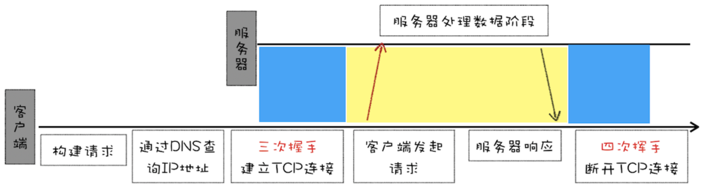
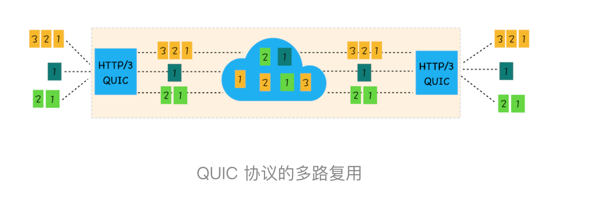

# 正文

## HTTP/1：HTTP性能优化

### 超文本传输协议 HTTP/0.9

HTTP/0.9 是于 1991 年提出的，主要用于学术交流，需求很简单——用来在网络之间传递 HTML 超文本的内容，所以被称为超文本传输协议。它的实现也很简单，采用了基于请求响应的模式，从客户端发出请求，服务器返回数据。

HTTP/0.9 的一个完整的请求流程（可参考下图）。

- 因为 HTTP 都是基于 TCP 协议的，所以客户端先要根据 IP 地址、端口和服务器建立 TCP 连接，而建立连接的过程就是 TCP 协议三次握手的过程。
- 建立好连接之后，会发送一个 GET 请求行的信息，如GET /index.html用来获取 index.html。
- 服务器接收请求信息之后，读取对应的 HTML 文件，并将数据以 ASCII 字符流返回给客户端。
- HTML 文档传输完成后，断开连接。



HTTP/0.9 的实现有以下三个特点。

1. 第一个是只有一个请求行，并没有 HTTP 请求头和请求体，因为只需要一个请求行就可以完整表达客户端的需求了。

2. 第二个是服务器也没有返回头信息，这是因为服务器端并不需要告诉客户端太多信息，只需要返回数据就可以了。

3. 第三个是返回的文件内容是以 ASCII 字符流来传输的，因为都是 HTML 格式的文件，所以使用 ASCII 字节码来传输是最合适的。

### 被浏览器推动的 HTTP/1.0

首先在浏览器中展示的不单是 HTML 文件了，还包括了 JavaScript、CSS、图片、音频、视频等不同类型的文件。因此支持多种类型的文件下载是 HTTP/1.0 的一个核心诉求，而且文件格式不仅仅局限于 ASCII 编码，还有很多其他类型编码的文件。

为了让客户端和服务器能更深入地交流，HTTP/1.0 引入了请求头和响应头，它们都是以为 Key-Value 形式保存的，在 HTTP 发送请求时，会带上请求头信息，服务器返回数据时，会先返回响应头信息。


HTTP/1.0 的方案是通过请求头和响应头来进行协商，在发起请求时候会通过 HTTP 请求头告诉服务器它期待服务器返回什么类型的文件、采取什么形式的压缩、提供什么语言的文件以及文件的具体编码。最终发送出来的请求头内容如下：

```()
accept: text/html
accept-encoding: gzip, deflate, br
accept-Charset: ISO-8859-1,utf-8
accept-language: zh-CN,zh
```

也就是说最终浏览器需要根据响应头的信息来处理数据。下面是一段响应头的数据信息：

```()
content-encoding: br
content-type: text/html; charset=UTF-8
```

HTTP/1.0 除了对多文件提供良好的支持外，还依据当时实际的需求引入了很多其他的特性，这些特性都是通过请求头和响应头来实现的。下面我们来看看新增的几个典型的特性：

- 有的请求服务器可能无法处理，或者处理出错，这时候就需要告诉浏览器服务器最终处理该请求的情况，这就引入了状态码。状态码是通过响应行的方式来通知浏览器的。
- 为了减轻服务器的压力，在 HTTP/1.0 中提供了 Cache 机制，用来缓存已经下载过的数据。
- 服务器需要统计客户端的基础信息，比如 Windows 和 macOS 的用户数量分别是多少，所以 HTTP/1.0 的请求头中还加入了用户代理的字段。

### 缝缝补补的 HTTP/1.1

1. 改进持久连接
    HTTP/1.1 中增加了持久连接的方法，它的特点是在一个 TCP 连接上可以传输多个 HTTP 请求，只要浏览器或者服务器没有明确断开连接，那么该 TCP 连接会一直保持。

    HTTP 的持久连接可以有效减少 TCP 建立连接和断开连接的次数，这样的好处是减少了服务器额外的负担，并提升整体 HTTP 的请求时长。

    持久连接在 HTTP/1.1 中是默认开启的，所以你不需要专门为了持久连接去 HTTP 请求头设置信息，如果你不想要采用持久连接，可以在 HTTP 请求头中加上Connection: close。目前浏览器中对于同一个域名，默认允许同时建立 6 个 TCP 持久连接。

2. 不成熟的 HTTP 管线化
    持久连接虽然能减少 TCP 的建立和断开次数，但是它需要等待前面的请求返回之后，才能进行下一次请求。如果 TCP 通道中的某个请求因为某些原因没有及时返回，那么就会阻塞后面的所有请求，这就是著名的队头阻塞的问题。HTTP/1.1 中试图通过管线化的技术来解决队头阻塞的问题。HTTP/1.1 中的管线化是指将多个 HTTP 请求整批提交给服务器的技术，虽然可以整批发送请求，不过服务器依然需要根据请求顺序来回复浏览器的请求。

3. 提供虚拟主机的支持
    在 HTTP/1.0 中，每个域名绑定了一个唯一的 IP 地址，因此一个服务器只能支持一个域名。但是随着虚拟主机技术的发展，需要实现在一台物理主机上绑定多个虚拟主机，每个虚拟主机都有自己的单独的域名，这些单独的域名都公用同一个 IP 地址。因此，HTTP/1.1 的请求头中增加了 Host 字段，用来表示当前的域名地址，这样服务器就可以根据不同的 Host 值做不同的处理。

4. 对动态生成的内容提供了完美支持
    HTTP/1.1 通过引入 Chunk transfer 机制来解决这个问题，服务器会将数据分割成若干个任意大小的数据块，每个数据块发送时会附上上个数据块的长度，最后使用一个零长度的块作为发送数据完成的标志。这样就提供了对动态内容的支持。

5. 客户端 Cookie、安全机制
    HTTP/1.1 还引入了客户端 Cookie 机制和安全机制。

HTTP/1.1 为网络效率做了大量的优化，最核心的有如下三种方式：

1. 增加了持久连接；

2. 浏览器为每个域名最多同时维护 6 个 TCP 持久连接；

3. 使用 CDN 的实现域名分片机制。

虽然 HTTP/1.1 在 HTTP/1.0 的基础之上做了大量的优化，但是由于一些效率问题始终很难解决，所以最终还是被 HTTP/2 所取代

#### HTTP/1.1 的主要问题

虽然 HTTP/1.1 采取了很多优化资源加载速度的策略，也取得了一定的效果，但是 HTTP/1.1对带宽的利用率却并不理想，这也是 HTTP/1.1 的一个核心问题。

带宽是指每秒最大能发送或者接收的字节数。我们把每秒能发送的最大字节数称为上行带宽，每秒能够接收的最大字节数称为下行带宽。

## HTTP/2：如何提升网络速度

之所以会出现这个问题，主要是由以下三个原因导致的。

1. 第一个原因，TCP 的慢启动
    一旦一个 TCP 连接建立之后，就进入了发送数据状态，刚开始 TCP 协议会采用一个非常慢的速度去发送数据，然后慢慢加快发送数据的速度，直到发送数据的速度达到一个理想状态，我们把这个过程称为慢启动。

    而之所以说慢启动会带来性能问题，是因为页面中常用的一些关键资源文件本来就不大，如 HTML 文件、CSS 文件和 JavaScript 文件，通常这些文件在 TCP 连接建立好之后就要发起请求的，但这个过程是慢启动，所以耗费的时间比正常的时间要多很多，这样就推迟了宝贵的首次渲染页面的时长了。

2. 第二个原因，同时开启了多条 TCP 连接，那么这些连接会竞争固定的带宽。
    你可以想象一下，系统同时建立了多条 TCP 连接，当带宽充足时，每条连接发送或者接收速度会慢慢向上增加；而一旦带宽不足时，这些 TCP 连接又会减慢发送或者接收的速度。比如一个页面有 200 个文件，使用了 3 个 CDN，那么加载该网页的时候就需要建立 6 * 3，也就是 18 个 TCP 连接来下载资源；在下载过程中，当发现带宽不足的时候，各个 TCP 连接就需要动态减慢接收数据的速度。

3. 第三个原因，HTTP/1.1 队头阻塞的问题
    我们知道在 HTTP/1.1 中使用持久连接时，虽然能公用一个 TCP 管道，但是在一个管道中同一时刻只能处理一个请求，在当前的请求没有结束之前，其他的请求只能处于阻塞状态。这意味着我们不能随意在一个管道中发送请求和接收内容。

### HTTP/2 的多路复用

HTTP/2 的思路就是一个域名只使用一个 TCP 长连接来传输数据，这样整个页面资源的下载过程只需要一次慢启动，同时也避免了多个 TCP 连接竞争带宽所带来的问题。

另外，就是队头阻塞的问题，等待请求完成后才能去请求下一个资源，这种方式无疑是最慢的，所以 HTTP/2 需要实现资源的并行请求，也就是任何时候都可以将请求发送给服务器，而并不需要等待其他请求的完成，然后服务器也可以随时返回处理好的请求资源给浏览器。

所以，HTTP/2 的解决方案可以总结为：一个域名只使用一个 TCP 长连接和消除队头阻塞问题。


HTTP/2 使用了多路复用技术，可以将请求分成一帧一帧的数据去传输，这样带来了一个额外的好处，就是当收到一个优先级高的请求时，比如接收到 JavaScript 或者 CSS 关键资源的请求，服务器可以暂停之前的请求来优先处理关键资源的请求。

#### 多路复用的实现


HTTP/2 添加了一个二进制分帧层，那我们就结合图来分析下 HTTP/2 的请求和接收过程。

- 首先，浏览器准备好请求数据，包括了请求行、请求头等信息，如果是 POST 方法，那么还要有请求体。
- 这些数据经过二进制分帧层处理之后，会被转换为一个个带有请求 ID 编号的帧，通过协议栈将这些帧发送给服务器
- 服务器接收到所有帧之后，会将所有相同 ID 的帧合并为一条完整的请求信息。
- 然后服务器处理该条请求，并将处理的响应行、响应头和响应体分别发送至二进制分帧层。
- 同样，二进制分帧层会将这些响应数据转换为一个个带有请求 ID 编号的帧，经过协议栈发送给浏览器。
- 浏览器接收到响应帧之后，会根据 ID 编号将帧的数据提交给对应的请求。

### HTTP/2 其他特性

1. 可以设置请求的优先级

2. 服务器推送

3. 头部压缩

## HTTP/3：甩掉TCP、TLS 的包袱，构建高效网络

### TCP 的队头阻塞

如果在数据传输的过程中，有一个数据因为网络故障或者其他原因而丢包了，那么整个 TCP 的连接就会处于暂停状态，需要等待丢失的数据包被重新传输过来。你可以把 TCP 连接看成是一个按照顺序传输数据的管道，管道中的任意一个数据丢失了，那之后的数据都需要等待该数据的重新传输


我们就把在 TCP 传输过程中，由于单个数据包的丢失而造成的阻塞称为 TCP 上的队头阻塞。

那队头阻塞是怎么影响 HTTP/2 传输的呢？首先我们来看正常情况下 HTTP/2 是怎么传输多路请求的，为了直观理解，你可以参考下图：


在 HTTP/2 中，多个请求是跑在一个 TCP 管道中的，如果其中任意一路数据流中出现了丢包的情况，那么就会阻塞该 TCP 连接中的所有请求。这不同于 HTTP/1.1，使用 HTTP/1.1 时，浏览器为每个域名开启了 6 个 TCP 连接，如果其中的 1 个 TCP 连接发生了队头阻塞，那么其他的 5 个连接依然可以继续传输数据。所以随着丢包率的增加，HTTP/2 的传输效率也会越来越差。有测试数据表明，当系统达到了 2% 的丢包率时，HTTP/1.1 的传输效率反而比 HTTP/2 表现得更好。

### TCP 建立连接的延时

网络延迟又称为 RTT（Round Trip Time）。我们把从浏览器发送一个数据包到服务器，再从服务器返回数据包到浏览器的整个往返时间称为 RTT（如下图）。RTT 是反映网络性能的一个重要指标。

需要有两个握手延迟过程。

1. 在建立 TCP 连接的时候，需要和服务器进行三次握手来确认连接成功，也就是说需要在消耗完 1.5 个 RTT 之后才能进行数据传输。

2. 进行 TLS 连接，TLS 有两个版本——TLS1.2 和 TLS1.3，每个版本建立连接所花的时间不同，大致是需要 1～2 个 RTT，关于 HTTPS 我们到后面到安全模块再做详细介绍。

### QUIC 协议

HTTP/2 存在一些比较严重的与 TCP 协议相关的缺陷，但由于 TCP 协议僵化，我们几乎不可能通过修改 TCP 协议自身来解决这些问题，那么解决问题的思路是绕过 TCP 协议，发明一个 TCP 和 UDP 之外的新的传输协议。但是这也面临着和修改 TCP 一样的挑战，因为中间设备的僵化，这些设备只认 TCP 和 UDP，如果采用了新的协议，新协议在这些设备同样不被很好地支持。因此，HTTP/3 选择了一个折衷的方法——UDP 协议，基于 UDP 实现了类似于 TCP 的多路数据流、传输可靠性等功能，我们把这套功能称为 QUIC 协议。


HTTP/3 中的 QUIC 协议集合了以下几点功能。

1. 实现了类似 TCP 的流量控制、传输可靠性的功能。虽然 UDP 不提供可靠性的传输，但 QUIC 在 UDP 的基础之上增加了一层来保证数据可靠性传输。它提供了数据包重传、拥塞控制以及其他一些 TCP 中存在的特性。

2. 集成了 TLS 加密功能。目前 QUIC 使用的是 TLS1.3，相较于早期版本 TLS1.3 有更多的优点，其中最重要的一点是减少了握手所花费的 RTT 个数。

3. 实现了 HTTP/2 中的多路复用功能。和 TCP 不同，QUIC 实现了在同一物理连接上可以有多个独立的逻辑数据流（如下图）。实现了数据流的单独传输，就解决了 TCP 中队头阻塞的问题。

4. 实现了快速握手功能。由于 QUIC 是基于 UDP 的，所以 QUIC 可以实现使用 0-RTT 或者 1-RTT 来建立连接，这意味着 QUIC 可以用最快的速度来发送和接收数据，这样可以大大提升首次打开页面的速度。



