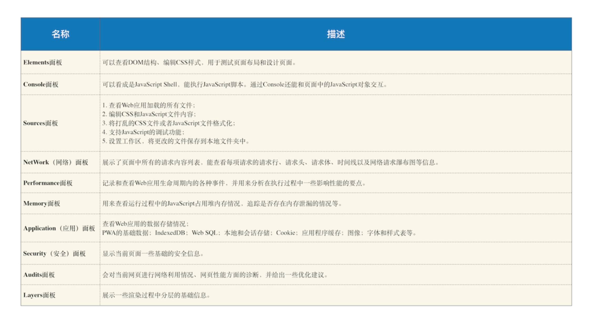

# 正文

## Chrome开发者工具：利用网络面板做性能分析

### Chrome 开发者工具



Chrome 开发者工具为我们提供了通过界面访问或者编辑 DOM 和 CSSOM 的能力，还提供了强大的调试功能和查看性能指标的能力。

### 网络面板

网络面板由控制器、过滤器、抓图信息、时间线、详细列表和下载信息概要这 6 个区域构成（如下图所示）。


1. 控制器
    
    - 红色圆点的按钮，表示“开始 / 暂停抓包”，这个功能很常见，很容易理解。
    - “全局搜索”按钮，这个功能就非常重要了，可以在所有下载资源中搜索相关内容，还可以快速定位到某几个你想要的文件上。
    - Disable cache，即“禁止从 Cache 中加载资源”的功能，它在调试 Web 应用的时候非常有用，因为开启了 Cache 会影响到网络性能测试的结果。
    - Online 按钮，是“模拟 2G/3G”功能，它可以限制带宽，模拟弱网情况下页面的展现情况，然后你就可以根据实际展示情况来动态调整策略，以便让 Web 应用更加适用于这些弱网。

2. 过滤器
    网络面板中的过滤器，主要就是起过滤功能。因为有时候一个页面有太多内容在详细列表区域中展示了，而你可能只想查看 JavaScript 文件或者 CSS 文件，这时候就可以通过过滤器模块来筛选你想要的文件类型。

3. 抓图信息
    抓图信息区域，可以用来分析用户等待页面加载时间内所看到的内容，分析用户实际的体验情况。比如，如果页面加载 1 秒多之后屏幕截图还是白屏状态，这时候就需要分析是网络还是代码的问题了。（勾选面板上的“Capture screenshots”即可启用屏幕截图。）

4. 时间线
    时间线，主要用来展示 HTTP、HTTPS、WebSocket 加载的状态和时间的一个关系，用于直观感受页面的加载过程。如果是多条竖线堆叠在一起，那说明这些资源被同时被加载。至于具体到每个文件的加载信息，还需要用到下面要讲的详细列表。

5. 详细列表
    这个区域是最重要的，它详细记录了每个资源从发起请求到完成请求这中间所有过程的状态，以及最终请求完成的数据信息。通过该列表，你就能很容易地去诊断一些网络问题。

6. 下载信息概要
    下载信息概要中，你要重点关注下 DOMContentLoaded 和 Load 两个事件，以及这两个事件的完成时间。

    - DOMContentLoaded，这个事件发生后，说明页面已经构建好 DOM 了，这意味着构建 DOM 所需要的 HTML 文件、JavaScript 文件、CSS 文件都已经下载完成了。
    - Load，说明浏览器已经加载了所有的资源（图像、样式表等）。通过下载信息概要面板，你可以查看触发这两个事件所花费的时间。

### 优化时间线上耗时项

1. 排队（Queuing）时间过久
    排队时间过久，大概率是由浏览器为每个域名最多维护 6 个连接导致的。那么基于这个原因，你就可以让 1 个站点下面的资源放在多个域名下面，比如放到 3 个域名下面，这样就可以同时支持 18 个连接了，这种方案称为域名分片技术。除了域名分片技术外，我个人还建议你把站点升级到 HTTP2，因为 HTTP2 已经没有每个域名最多维护 6 个 TCP 连接的限制了。

2. 第一字节时间（TTFB）时间过久
    这可能的原因有如下：
    - 服务器生成页面数据的时间过久。对于动态网页来说，服务器收到用户打开一个页面的请求时，首先要从数据库中读取该页面需要的数据，然后把这些数据传入到模板中，模板渲染后，再返回给用户。服务器在处理这个数据的过程中，可能某个环节会出问题。
    - 网络的原因。比如使用了低带宽的服务器，或者本来用的是电信的服务器，可联通的网络用户要来访问你的服务器，这样也会拖慢网速。
    - 发送请求头时带上了多余的用户信息。比如一些不必要的 Cookie 信息，服务器接收到这些 Cookie 信息之后可能需要对每一项都做处理，这样就加大了服务器的处理时长。
    面对第一种服务器的问题，你可以想办法去提高服务器的处理速度，比如通过增加各种缓存的技术；针对第二种网络问题，你可以使用 CDN 来缓存一些静态文件；至于第三种，你在发送请求时就去尽可能地减少一些不必要的 Cookie 数据信息。

3. Content Download 时间过久
    如果单个请求的 Content Download 花费了大量时间，有可能是字节数太多的原因导致的。这时候你就需要减少文件大小，比如压缩、去掉源码中不必要的注释等方法。

## DOM树：JavaScript是如何影响DOM树构建的


字节流转换为 DOM 需要三个阶段。第一个阶段，通过分词器将字节流转换为 Token。后续的第二个和第三个阶段是同步进行的，需要将 Token 解析为 DOM 节点，并将 DOM 节点添加到 DOM 树中。

HTML 解析器维护了一个 Token 栈结构，该 Token 栈主要用来计算节点之间的父子关系，在第一个阶段中生成的 Token 会被按照顺序压到这个栈中。具体的处理规则如下所示：

- 如果压入到栈中的是 StartTag Token，HTML 解析器会为该 Token 创建一个 DOM 节点，然后将该节点加入到 DOM 树中，它的父节点就是栈中相邻的那个元素生成的节点。
- 如果分词器解析出来是文本 Token，那么会生成一个文本节点，然后将该节点加入到 DOM 树中，文本 Token 是不需要压入到栈中，它的父节点就是当前栈顶 Token 所对应的 DOM 节点。
- 如果分词器解析出来的是 EndTag 标签，比如是 EndTag div，HTML 解析器会查看 Token 栈顶的元素是否是 StarTag div，如果是，就将 StartTag div 从栈中弹出，表示该 div 元素解析完成。

## 渲染流水线：CSS如何影响首次加载时的白屏时间


### 渲染流水线为什么需要 CSSOM 呢

和 HTML 一样，渲染引擎也是无法直接理解 CSS 文件内容的，所以需要将其解析成渲染引擎能够理解的结构，这个结构就是 CSSOM。和 DOM 一样，CSSOM 也具有两个作用，第一个是提供给 JavaScript 操作样式表的能力，第二个是为布局树的合成提供基础的样式信息。这个 CSSOM 体现在 DOM 中就是document.styleSheets

### 影响页面展示的因素以及优化策略

渲染流水线影响到了首次页面展示的速度，而首次页面展示的速度又直接影响到了用户体验，

从发起 URL 请求开始，到首次显示页面的内容，在视觉上经历的三个阶段。

1. 第一个阶段，等请求发出去之后，到提交数据阶段，这时页面展示出来的还是之前页面的内容。关于提交数据你可以参考前面《04 | 导航流程：从输入 URL 到页面展示，这中间发生了什么？》这篇文章。
2. 第二个阶段，提交数据之后渲染进程会创建一个空白页面，我们通常把这段时间称为解析白屏，并等待 CSS 文件和 JavaScript 文件的加载完成，生成 CSSOM 和 DOM，然后合成布局树，最后还要经过一系列的步骤准备首次渲染。
3. 第三个阶段，等首次渲染完成之后，就开始进入完整页面的生成阶段了，然后页面会一点点被绘制出来。

通常情况下的瓶颈主要体现在下载 CSS 文件、下载 JavaScript 文件和执行 JavaScript。所以要想缩短白屏时长，可以有以下策略：

- 通过内联 JavaScript、内联 CSS 来移除这两种类型的文件下载，这样获取到 HTML 文件之后就可以直接开始渲染流程了。
- 但并不是所有的场合都适合内联，那么还可以尽量减少文件大小，比如通过 webpack 等工具移除一些不必要的注释，并压缩 JavaScript 文件。
- 还可以将一些不需要在解析 HTML 阶段使用的 JavaScript 标记上 sync 或者 defer。
- 对于大的 CSS 文件，可以通过媒体查询属性，将其拆分为多个不同用途的 CSS 文件，这样只有在特定的场景下才会加载特定的 CSS 文件。

通过以上策略就能缩短白屏展示的时长了，不过在实际项目中，总是存在各种各样的情况，这些策略并不能随心所欲地去引用，所以还需要结合实际情况来调整最佳方案。

## 分层和合成机制：为什么CSS动画比JavaScript高效

### 帧 VS 帧率

大多数设备屏幕的更新频率是 60 次 / 秒，这也就意味着正常情况下要实现流畅的动画效果，渲染引擎需要每秒更新 60 张图片到显卡的后缓冲区。我们把渲染流水线生成的每一副图片称为一帧，把渲染流水线每秒更新了多少帧称为帧率，比如滚动过程中 1 秒更新了 60 帧，那么帧率就是 60Hz（或者 60FPS）。

Chrome 中的合成技术，可以用三个词来概括总结：分层、分块和合成。

### 分层和合成

为了提升每帧的渲染效率，Chrome 引入了分层和合成的机制。那该怎么来理解分层和合成机制呢？

你可以把一张网页想象成是由很多个图片叠加在一起的，每个图片就对应一个图层，Chrome 合成器最终将这些图层合成了用于显示页面的图片。如果你熟悉 PhotoShop 的话，就能很好地理解这个过程了，PhotoShop 中一个项目是由很多图层构成的，每个图层都可以是一张单独图片，可以设置透明度、边框阴影，可以旋转或者设置图层的上下位置，将这些图层叠加在一起后，就能呈现出最终的图片了。

在这个过程中，将素材分解为多个图层的操作就称为分层，最后将这些图层合并到一起的操作就称为合成。所以，分层和合成通常是一起使用的。

**需要重点关注的是，合成操作是在合成线程上完成的，这也就意味着在执行合成操作时，是不会影响到主线程执行的。这就是为什么经常主线程卡住了，但是 CSS 动画依然能执行的原因。**

### 分块

如果说分层是从宏观上提升了渲染效率，那么分块则是从微观层面提升了渲染效率。

因此，合成线程会将每个图层分割为大小固定的图块，然后优先绘制靠近视口的图块，这样就可以大大加速页面的显示速度。不过有时候， 即使只绘制那些优先级最高的图块，也要耗费不少的时间，因为涉及到一个很关键的因素——纹理上传，这是因为从计算机内存上传到 GPU 内存的操作会比较慢。为了解决这个问题，Chrome 又采取了一个策略：在首次合成图块的时候使用一个低分辨率的图片。

### 如何利用分层技术优化代码

在写 Web 应用的时候，你可能经常需要对某个元素做几何形状变换、透明度变换或者一些缩放操作，如果使用 JavaScript 来写这些效果，会牵涉到整个渲染流水线，所以 JavaScript 的绘制效率会非常低下。

这时你可以使用 will-change 来告诉渲染引擎你会对该元素做一些特效变换，CSS 代码如下：

```()
.box {
will-change: transform, opacity;
}
```

这段代码就是提前告诉渲染引擎 box 元素将要做几何变换和透明度变换操作，这时候渲染引擎会将该元素单独实现一帧，等这些变换发生时，渲染引擎会通过合成线程直接去处理变换，这些变换并没有涉及到主线程，这样就大大提升了渲染的效率。这也是 CSS 动画比 JavaScript 动画高效的原因。

但是凡事都有两面性，每当渲染引擎为一个元素准备一个独立层的时候，它占用的内存也会大大增加，因为从层树开始，后续每个阶段都会多一个层结构，这些都需要额外的内存，所以你需要恰当地使用 will-change。

## 页面性能：如何系统地优化页面

通常一个页面有三个阶段：加载阶段、交互阶段和关闭阶段。

- 加载阶段，是指从发出请求到渲染出完整页面的过程，影响到这个阶段的主要因素有网络和 JavaScript 脚本。
- 交互阶段，主要是从页面加载完成到用户交互的整合过程，影响到这个阶段的主要因素是 JavaScript 脚本。
- 关闭阶段，主要是用户发出关闭指令后页面所做的一些清理操作。

这里我们需要重点关注加载阶段和交互阶段，

### 加载阶段


我们把这些能阻塞网页首次渲染的资源称为关键资源。基于关键资源，我们可以继续细化出来三个影响页面首次渲染的核心因素。

- 第一个是关键资源个数。关键资源个数越多，首次页面的加载时间就会越长。比如上图中的关键资源个数就是 3 个，1 个 HTML 文件、1 个 JavaScript 和 1 个 CSS 文件。
- 第二个是关键资源大小。通常情况下，所有关键资源的内容越小，其整个资源的下载时间也就越短，那么阻塞渲染的时间也就越短。上图中关键资源的大小分别是 6KB、8KB 和 9KB，那么整个关键资源大小就是 23KB。
- 第三个是请求关键资源需要多少个 RTT（Round Trip Time）。数据并不是一次传输到服务端的，而是需要拆分成一个个数据包来回多次进行传输的。RTT 就是这里的往返时延。它是网络中一个重要的性能指标，表示从发送端发送数据开始，到发送端收到来自接收端的确认，总共经历的时延,通常 1 个 HTTP 的数据包在 14KB 左右，所以 1 个 0.1M 的页面就需要拆分成 8 个包来传输了，也就是说需要 8 个 RTT

总的优化原则就是减少关键资源个数，降低关键资源大小，降低关键资源的 RTT 次数。

- 如何减少关键资源的个数？一种方式是可以将 JavaScript 和 CSS 改成内联的形式，比如上图的 JavaScript 和 CSS，若都改成内联模式，那么关键资源的个数就由 3 个减少到了 1 个。另一种方式，如果 JavaScript 代码没有 DOM 或者 CSSOM 的操作，则可以改成 async 或者 defer 属性；同样对于 CSS，如果不是在构建页面之前加载的，则可以添加媒体取消阻止显现的标志。当 JavaScript 标签加上了 async 或者 defer、CSSlink 属性之前加上了取消阻止显现的标志后，它们就变成了非关键资源了。
- 如何减少关键资源的大小？可以压缩 CSS 和 JavaScript 资源，移除 HTML、CSS、JavaScript 文件中一些注释内容，也可以通过前面讲的取消 CSS 或者 JavaScript 中关键资源的方式。
- 如何减少关键资源 RTT 的次数？可以通过减少关键资源的个数和减少关键资源的大小搭配来实现。除此之外，还可以使用 CDN 来减少每次 RTT 时长。

### 交互阶段

1. 减少 JavaScript 脚本执行时间
    有时 JavaScript 函数的一次执行时间可能有几百毫秒，这就严重霸占了主线程执行其他渲染任务的时间。针对这种情况我们可以采用以下两种策略：一种是将一次执行的函数分解为多个任务，使得每次的执行时间不要过久。另一种是采用 Web Workers。你可以把 Web Workers 当作主线程之外的一个线程，在 Web Workers 中是可以执行 JavaScript 脚本的，不过 Web Workers 中没有 DOM、CSSOM 环境，这意味着在 Web Workers 中是无法通过 JavaScript 来访问 DOM 的，所以我们可以把一些和 DOM 操作无关且耗时的任务放到 Web Workers 中去执行。总之，在交互阶段，对 JavaScript 脚本总的原则就是不要一次霸占太久主线程。

2. 避免强制同步布局
    所谓强制同步布局，是指 JavaScript 强制将计算样式和布局操作提前到当前的任务中。

    ```()
    function foo() {
        let main_div = document.getElementById("mian_div")
        let new_node = document.createElement("li")
        let textnode = document.createTextNode("time.geekbang")
        new_node.appendChild(textnode);
        document.getElementById("mian_div").appendChild(new_node);
        //由于要获取到offsetHeight，
        //但是此时的offsetHeight还是老的数据，
        //所以需要立即执行布局操作
        console.log(main_div.offsetHeight)
    }
    ```

3. 避免布局抖动
    所谓布局抖动，是指在一次 JavaScript 执行过程中，多次执行强制布局和抖动操作。

    ```()
    function foo() {
        let time_li = document.getElementById("time_li")
        for (let i = 0; i < 100; i++) {
            let main_div = document.getElementById("mian_div")
            let new_node = document.createElement("li")
            let textnode = document.createTextNode("time.geekbang")
            new_node.appendChild(textnode);
            new_node.offsetHeight = time_li.offsetHeight;
            document.getElementById("mian_div").appendChild(new_node);
        }
    }
    ```

4. 合理利用 CSS 合成动画
    合成动画是直接在合成线程上执行的，这和在主线程上执行的布局、绘制等操作不同，如果主线程被 JavaScript 或者一些布局任务占用，CSS 动画依然能继续执行。所以要尽量利用好 CSS 合成动画，如果能让 CSS 处理动画，就尽量交给 CSS 来操作。

5. 避免频繁的垃圾回收
    尽可能优化储存结构，尽可能避免小颗粒对象的产生。(比如序列化)

## 虚拟DOM：虚拟DOM和实际的DOM有何不同

### 什么是虚拟 DOM

在谈论什么是虚拟 DOM 之前，我们先来看看虚拟 DOM 到底要解决哪些事情。将页面改变的内容应用到虚拟 DOM 上，而不是直接应用到 DOM 上。变化被应用到虚拟 DOM 上时，虚拟 DOM 并不急着去渲染页面，而仅仅是调整虚拟 DOM 的内部状态，这样操作虚拟 DOM 的代价就变得非常轻了。在虚拟 DOM 收集到足够的改变时，再把这些变化一次性应用到真实的 DOM 上。


虚拟 DOM 到底怎么运行的。

- 创建阶段。首先依据 JSX 和基础数据创建出来虚拟 DOM，它反映了真实的 DOM 树的结构。然后由虚拟 DOM 树创建出真实 DOM 树，真实的 DOM 树生成完后，再触发渲染流水线往屏幕输出页面。
- 更新阶段。如果数据发生了改变，那么就需要根据新的数据创建一个新的虚拟 DOM 树；然后 React 比较两个树，找出变化的地方，并把变化的地方一次性更新到真实的 DOM 树上；最后渲染引擎更新渲染流水线，并生成新的页面。

React Fiber 更新机制。

最开始的时候，比较两个虚拟 DOM 的过程是在一个递归函数里执行的，其核心算法是 reconciliation。通常情况下，这个比较过程执行得很快，不过当虚拟 DOM 比较复杂的时候，执行比较函数就有可能占据主线程比较久的时间，这样就会导致其他任务的等待，造成页面卡顿。为了解决这个问题，React 团队重写了 reconciliation 算法，新的算法称为 Fiber reconciler，之前老的算法称为 Stack reconciler。其实协程的另外一个称呼就是 Fiber

那么所谓的 Fiber reconciler 相信你也很清楚了，就是在执行算法的过程中出让主线程，这样就解决了 Stack reconciler 函数占用时间过久的问题。

#### 双缓存

在开发游戏或者处理其他图像的过程中，屏幕从前缓冲区读取数据然后显示。但是很多图形操作都很复杂且需要大量的运算，比如一幅完整的画面，可能需要计算多次才能完成，如果每次计算完一部分图像，就将其写入缓冲区，那么就会造成一个后果，那就是在显示一个稍微复杂点的图像的过程中，你看到的页面效果可能是一部分一部分地显示出来，因此在刷新页面的过程中，会让用户感受到界面的闪烁。

而使用双缓存，可以让你先将计算的中间结果存放在另一个缓冲区中，等全部的计算结束，该缓冲区已经存储了完整的图形之后，再将该缓冲区的图形数据一次性复制到显示缓冲区，这样就使得整个图像的输出非常稳定。

在这里，你可以把虚拟 DOM 看成是 DOM 的一个 buffer，和图形显示一样，它会在完成一次完整的操作之后，再把结果应用到 DOM 上，这样就能减少一些不必要的更新，同时还能保证 DOM 的稳定输出。

#### MVC 模式


MVC 的整体结构比较简单，由模型、视图和控制器组成，其核心思想就是将数据和视图分离

我们可以把虚拟 DOM 看成是 MVC 的视图部分，其控制器和模型都是由 Redux 提供的。其具体实现过程如下：

- 图中的控制器是用来监控 DOM 的变化，一旦 DOM 发生变化，控制器便会通知模型，让其更新数据；
- 模型数据更新好之后，控制器会通知视图，告诉它模型的数据发生了变化；
- 视图接收到更新消息之后，会根据模型所提供的数据来生成新的虚拟 DOM；
- 新的虚拟 DOM 生成好之后，就需要与之前的虚拟 DOM 进行比较，找出变化的节点；
- 比较出变化的节点之后，React 将变化的虚拟节点应用到 DOM 上，这样就会触发 DOM 节点的更新；
- DOM 节点的变化又会触发后续一系列渲染流水线的变化，从而实现页面的更新。

## 渐进式网页应用（PWA）：它究竟解决了Web应用的哪些问题

PWA，全称是 Progressive Web App，翻译过来就是渐进式网页应用。根据字面意思，它就是“渐进式 +Web 应用”。对于 Web 应用很好理解了，就是目前我们普通的 Web 页面，所以 PWA 所支持的首先是一个 Web 页面。至于“渐进式”，就需要从下面两个方面来理解。

- 站在 Web 应用开发者来说，PWA 提供了一个渐进式的过渡方案，让 Web 应用能逐步具有本地应用的能力。采取渐进式可以降低站点改造的代价，使得站点逐步支持各项新技术，而不是一步到位。
- 站在技术角度来说，PWA 技术也是一个渐进式的演化过程，在技术层面会一点点演进，比如逐渐提供更好的设备特性支持，不断优化更加流畅的动画效果，不断让页面的加载速度变得更快，不断实现本地应用的特性。

它是一套理念，渐进式增强 Web 的优势，并通过技术手段渐进式缩短和本地应用或者小程序的距离。

### Web 应用 VS 本地应用

首先，Web 应用缺少离线使用能力，在离线或者在弱网环境下基本上是无法使用的。而用户需要的是沉浸式的体验，在离线或者弱网环境下能够流畅地使用是用户对一个应用的基本要求。

其次，Web 应用还缺少了消息推送的能力，因为作为一个 App 厂商，需要有将消息送达到应用的能力。

最后，Web 应用缺少一级入口，也就是将 Web 应用安装到桌面，在需要的时候直接从桌面打开 Web 应用，而不是每次都需要通过浏览器来打开。

针对以上 Web 缺陷，PWA 提出了两种解决方案：通过引入 Service Worker 来试着解决离线存储和消息推送的问题，通过引入 manifest.json 来解决一级入口的问题

### 什么是 Service Worker

它的主要思想是在页面和网络之间增加一个拦截器，用来缓存和拦截请求


在目前的 Chrome 架构中，Service Worker 是运行在浏览器进程中的，因为浏览器进程生命周期是最长的，所以在浏览器的生命周期内，能够为所有的页面提供服务。
消息推送也是基于 Service Worker 来实现的。因为消息推送时，浏览器页面也许并没有启动，这时就需要 Service Worker 来接收服务器推送的消息，并将消息通过一定方式展示给用户。
要使站点支持 Service Worker，首先必要的一步就是要将站点升级到 HTTPS。除了必须要使用 HTTPS，Service Worker 还需要同时支持 Web 页面默认的安全策略、储入同源策略、内容安全策略（CSP）等

## WebComponent：像搭积木一样构建Web应用

其实组件化并没有一个明确的定义，不过这里我们可以使用 10 个字来形容什么是组件化，那就是：对内高内聚，对外低耦合。对内各个元素彼此紧密结合、相互依赖，对外和其他组件的联系最少且接口简单。

### WebComponent 组件化开发

现在我们了解了 CSS 和 DOM 是阻碍组件化的两个因素，那要怎么解决呢？

WebComponent 给出了解决思路，它提供了对局部视图封装能力，可以让 DOM、CSSOM 和 JavaScript 运行在局部环境中，这样就使得局部的 CSS 和 DOM 不会影响到全局。

```()
//获取组件模板
const content = document.querySelector('#geekbang-t').content;
//创建影子DOM节点
const shadowDOM = this.attachShadow({ mode: 'open' });
//将模板添加到影子DOM上
shadowDOM.appendChild(content.cloneNode(true));
```

要使用 WebComponent，通常要实现下面三个步骤。

1. 首先，使用 template 属性来创建模板。利用 DOM 可以查找到模板的内容，但是模板元素是不会被渲染到页面上的，也就是说 DOM 树中的 template 节点不会出现在布局树中，所以我们可以使用 template 来自定义一些基础的元素结构，这些基础的元素结构是可以被重复使用的。一般模板定义好之后，我们还需要在模板的内部定义样式信息。

2. 其次，我们需要创建一个 GeekBang 的类。在该类的构造函数中要完成三件事：

    - 查找模板内容；
    - 创建影子 DOM；
    - 再将模板添加到影子 DOM 上

    其实影子 DOM 的作用是将模板中的内容与全局 DOM 和 CSS 进行隔离，这样我们就可以实现元素和样式的私有化了。你可以把影子 DOM 看成是一个作用域，其内部的样式和元素是不会影响到全局的样式和元素的，而在全局环境下，要访问影子 DOM 内部的样式或者元素也是需要通过约定好的接口的。

3. 最后，就很简单了，可以像正常使用 HTML 元素一样使用该元素。

### 浏览器如何实现影子 DOM


浏览器为了实现影子 DOM 的特性，在代码内部做了大量的条件判断，比如当通过 DOM 接口去查找元素时，渲染引擎会去判断 geek-bang 属性下面的 shadow-root 元素是否是影子 DOM，如果是影子 DOM，那么就直接跳过 shadow-root 元素的查询操作。所以这样通过 DOM API 就无法直接查询到影子 DOM 的内部元素了。

另外，当生成布局树的时候，渲染引擎也会判断 geek-bang 属性下面的 shadow-root 元素是否是影子 DOM，如果是，那么在影子 DOM 内部元素的节点选择 CSS 样式的时候，会直接使用影子 DOM 内部的 CSS 属性。所以这样最终渲染出来的效果就是影子 DOM 内部定义的样式。
