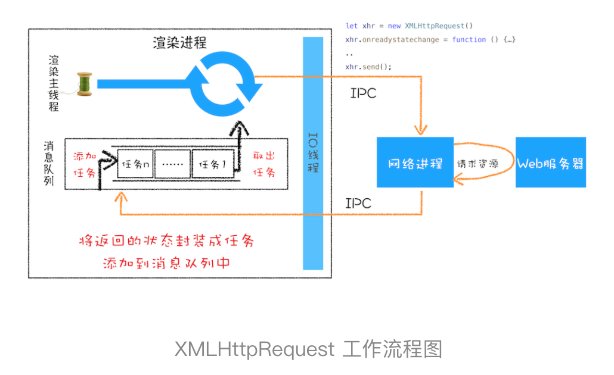

# 正文

## 消息队列和事件循环：页面是怎么“活”起来的

### 使用单线程处理安排好的任务


### 在线程运行过程中处理新任务

要想在线程运行过程中，能接收并执行新的任务，就需要采用事件循环机制。


### 处理其他线程发送过来的任务


如何设计好一个线程模型，能让其能够接收其他线程发送的消息呢？一个通用模式是使用消息队列


从图中可以看出，消息队列是一种数据结构，可以存放要执行的任务。它符合队列“先进先出”的特点，也就是说要添加任务的话，添加到队列的尾部；要取出任务的话，从队列头部去取。


从上图可以看出，我们的改造可以分为下面三个步骤：

1. 添加一个消息队列；
2. IO 线程中产生的新任务添加进消息队列尾部；
3. 渲染主线程会循环地从消息队列头部中读取任务，执行任务。

### 处理其他进程发送过来的任务


渲染进程专门有一个 IO 线程用来接收其他进程传进来的消息，接收到消息之后，会将这些消息组装成任务发送给渲染主线程。

### 消息队列中的任务类型

可以参考下Chromium 的官方源码，这里面包含了很多内部消息类型，如输入事件（鼠标滚动、点击、移动）、微任务、文件读写、WebSocket、JavaScript 定时器等等。除此之外，消息队列中还包含了很多与页面相关的事件，如 JavaScript 执行、解析 DOM、样式计算、布局计算、CSS 动画等。

### 如何安全退出

Chrome 是这样解决的，确定要退出当前页面时，页面主线程会设置一个退出标志的变量，在每次执行完一个任务时，判断是否有设置退出标志。如果设置了，那么就直接中断当前的所有任务，退出线程。

### 页面使用单线程的缺点

#### 第一个问题是如何处理高优先级的任务

一个典型的场景是监控 DOM 节点的变化情况（节点的插入、修改、删除等动态变化），然后根据这些变化来处理相应的业务逻辑

不过这个模式有个问题，因为 DOM 变化非常频繁，如果每次发生变化的时候，都直接调用相应的 JavaScript 接口，那么这个当前的任务执行时间会被拉长，从而导致执行效率的下降。

如果 DOM 发生变化，采用同步通知的方式，会影响当前任务的执行效率；如果采用异步方式，又会影响到监控的实时性。

通常我们把消息队列中的任务称为宏任务，每个宏任务中都包含了一个微任务队列，在执行宏任务的过程中，如果 DOM 有变化，那么就会将该变化添加到微任务列表中，这样就不会影响到宏任务的继续执行，因此也就解决了执行效率的问题。等宏任务中的主要功能都直接完成之后，这时候，渲染引擎并不着急去执行下一个宏任务，而是执行当前宏任务中的微任务，因为 DOM 变化的事件都保存在这些微任务队列中，这样也就解决了实时性问题。

chromium中，当执行一个宏任务时，才会创建微任务队列，等遇到checkpoint时就会执行微任务！

#### 第二个是如何解决单个任务执行时长过久的问题

因为所有的任务都是在单线程中执行的，所以每次只能执行一个任务，而其他任务就都处于等待状态。如果其中一个任务执行时间过久，那么下一个任务就要等待很长时间。

针对这种情况，JavaScript 可以通过回调功能来规避这种问题，也就是让要执行的 JavaScript 任务滞后执行

## WebAPI：setTimeout是如何实现的

### 浏览器怎么实现 setTimeout

在 Chrome 中除了正常使用的消息队列之外，还有另外一个消息队列，这个队列中维护了需要延迟执行的任务列表，包括了定时器和 Chromium 内部一些需要延迟执行的任务。所以当通过 JavaScript 创建一个定时器时，渲染进程会将该定时器的回调任务添加到延迟队列中。

```()
void ProcessTimerTask(){
    //从delayed_incoming_queue中取出已经到期的定时器任务
    //依次执行这些任务
}
TaskQueue task_queue；
void ProcessTask();
bool keep_running = true;
void MainTherad(){
    for(;;){
        //执行消息队列中的任务
        Task task = task_queue.takeTask();
        ProcessTask(task);

        ProcessDelayTask(); //执行延迟队列中的任务

        if(!keep_running) //如果设置了退出标志，那么直接退出线程循环
            break;
    }
}
```

我们添加了一个 ProcessDelayTask 函数，该函数是专门用来处理延迟执行任务的。这里我们要重点关注它的执行时机，在上段代码中，处理完消息队列中的一个任务之后，就开始执行 ProcessDelayTask 函数。ProcessDelayTask 函数会根据发起时间和延迟时间计算出到期的任务，然后依次执行这些到期的任务。等到期的任务执行完成之后，再继续下一个循环过程。通过这样的方式，一个完整的定时器就实现了。

其实浏览器内部实现取消定时器的操作也是非常简单的，就是直接从 delayed_incoming_queue 延迟队列中，通过 ID 查找到对应的任务，然后再将其从队列中删除掉就可以了。

### 使用 setTimeout 的一些注意事项

1. 如果当前任务执行时间过久，会影响定时器任务的执行

2. 如果 setTimeout 存在嵌套调用，那么系统会设置最短时间间隔为 4 毫秒

3. 未激活的页面，setTimeout 执行最小间隔是 1000 毫秒，目的是为了优化后台页面的加载损耗以及降低耗电量。这一点你在使用定时器的时候要注意。

4. 延时执行时间有最大值，那就是 Chrome、Safari、Firefox 都是以 32 个 bit 来存储延时值的，32bit 最大只能存放的数字是 2147483647 毫秒，这就意味着，如果 setTimeout 设置的延迟值大于 2147483647 毫秒（大约 24.8 天）时就会溢出，那么相当于延时值被设置为 0 了，这导致定时器会被立即执行。

### requestAnimationFrame

requestAnimationFrame 提供一个原生的API去执行动画的效果，它会在一帧（一般是16ms）间隔内根据选择浏览器情况去执行相关动作。
setTimeout是在特定的时间间隔去执行任务，不到时间间隔不会去执行，这样浏览器就没有办法去自动优化。

## WebAPI：XMLHttpRequest是怎么实现的

XMLHttpRequest 提供了从 Web 服务器获取数据的能力，如果你想要更新某条数据，只需要通过 XMLHttpRequest 请求服务器提供的接口，就可以获取到服务器的数据，然后再操作 DOM 来更新页面内容，整个过程只需要更新网页的一部分就可以了，而不用像之前那样还得刷新整个页面，这样既有效率又不会打扰到用户

### 回调函数 VS 系统调用栈

那什么是回调函数呢（Callback Function）？将一个函数作为参数传递给另外一个函数，那作为参数的这个函数就是回调函数。

```()
let callback = function(){
    console.log('i am do homework')
}
function doWork(cb) {
    console.log('start do work')
    cb()
    console.log('end do work')
}
doWork(callback)
```

回调函数 callback 是在主函数 doWork 返回之前执行的，我们把这个回调过程称为同步回调。

```()
let callback = function(){
    console.log('i am do homework')
}
function doWork(cb) {
    console.log('start do work')
    setTimeout(cb,1000);
    console.log('end do work')
}
doWork(callback)
```

我们把这种回调函数在主函数外部执行的过程称为异步回调。

### XMLHttpRequest 运作机制



## 宏任务和微任务：不是所有任务都是一个待遇

消息队列中这种粗时间颗粒度的任务已经不能胜任部分领域的需求，所以又出现了一种新的技术——微任务。微任务可以在实时性和效率之间做一个有效的权衡。

微任务已经被广泛地应用，基于微任务的技术有 MutationObserver、Promise 以及以 Promise 为基础开发出来的很多其他的技术

### 宏任务

前面我们已经介绍过了，页面中的大部分任务都是在主线程上执行的，这些任务包括了：

- 渲染事件（如解析 DOM、计算布局、绘制）；
- 用户交互事件（如鼠标点击、滚动页面、放大缩小等）；
- JavaScript 脚本执行事件；
- 网络请求完成、文件读写完成事件。

### 微任务

微任务就是一个需要异步执行的函数，执行时机是在主函数执行结束之后、当前宏任务结束之前。

在现代浏览器里面，产生微任务有两种方式。

1. 第一种方式是使用 MutationObserver 监控某个 DOM 节点，然后再通过 JavaScript 来修改这个节点，或者为这个节点添加、删除部分子节点，当 DOM 节点发生变化时，就会产生 DOM 变化记录的微任务。

2. 第二种方式是使用 Promise，当调用 Promise.resolve() 或者 Promise.reject() 的时候，也会产生微任务。


从上面分析我们可以得出如下几个结论：

- 微任务和宏任务是绑定的，每个宏任务在执行时，会创建自己的微任务队列。
- 微任务的执行时长会影响到当前宏任务的时长。比如一个宏任务在执行过程中，产生了 100 个微任务，执行每个微任务的时间是 10 毫秒，那么执行这 100 个微任务的时间就是 1000 毫秒，也可以说这 100 个微任务让宏任务的执行时间延长了 1000 毫秒。所以你在写代码的时候一定要注意控制微任务的执行时长。
- 在一个宏任务中，分别创建一个用于回调的宏任务和微任务，无论什么情况下，微任务都早于宏任务执行。

MutationObserver 采用了“异步 + 微任务”的策略。

- 通过异步操作解决了同步操作的性能问题；
- 通过微任务解决了实时性的问题。

## Promise：使用Promise，告别回调函数

首先，Promise 实现了回调函数的延时绑定。回调函数的延时绑定在代码上体现就是先创建 Promise 对象 x1，通过 Promise 的构造函数 executor 来执行业务逻辑；创建好 Promise 对象 x1 之后，再使用 x1.then 来设置回调函数

```()
//创建Promise对象x1，并在executor函数中执行业务逻辑
function executor(resolve, reject){
    resolve(100)
}
let x1 = new Promise(executor)


//x1延迟绑定回调函数onResolve
function onResolve(value){
    console.log(value)
}
x1.then(onResolve)
```

其次，需要将回调函数 onResolve 的返回值穿透到最外层。因为我们会根据 onResolve 函数的传入值来决定创建什么类型的 Promise 任务，创建好的 Promise 对象需要返回到最外层，这样就可以摆脱嵌套循环了。

### Promise 与微任务

```()
function Bromise(executor) {
    var onResolve_ = null
    var onReject_ = null
     //模拟实现resolve和then，暂不支持rejcet
    this.then = function (onResolve, onReject) {
        onResolve_ = onResolve
    };
    function resolve(value) {
        setTimeout(()=>{
            onResolve_(value)
        },0)
    }
    executor(resolve, null);
}

function executor(resolve, reject) {
    resolve(100)
}
//将Promise改成我们自己的Bromsie
let demo = new Bromise(executor)

function onResolve(value){
    console.log(value)
}
demo.then(onResolve)
```

上述为一个模拟Promise的示例

### 相关题目

1、Promise 中为什么要引入微任务？

由于promise采用.then延时绑定回调机制，而new Promise时又需要直接执行promise中的方法，即发生了先执行方法后添加回调的过程，此时需等待then方法绑定两个回调后才能继续执行方法回调，便可将回调添加到当前js调用栈中执行结束后的任务队列中，由于宏任务较多容易堵塞，则采用了微任务

2、Promise 中是如何实现回调函数返回值穿透的？
首先Promise的执行结果保存在promise的data变量中，然后是.then方法返回值为使用resolved或rejected回调方法新建的一个promise对象，即例如成功则返回new Promise（resolved），将前一个promise的data值赋给新建的promise

3、Promise 出错后，是怎么通过“冒泡”传递给最后那个捕获
promise内部有resolved_和rejected_变量保存成功和失败的回调，进入.then（resolved，rejected）时会判断rejected参数是否为函数，若是函数，错误时使用rejected处理错误；若不是，则错误时直接throw错误，一直传递到最后的捕获，若最后没有被捕获，则会报错。可通过监听unhandledrejection事件捕获未处理的promise错误

## async/await：使用同步的方式去写异步代码

### 什么是生成器函数（Generator）

生成器函数是一个带星号函数，而且是可以暂停执行和恢复执行的

要搞懂函数为何能暂停和恢复，那你首先要了解协程的概念。协程是一种比线程更加轻量级的存在。

正如一个进程可以拥有多个线程一样，一个线程也可以拥有多个协程。最重要的是，协程不是被操作系统内核所管理，而完全是由程序所控制（也就是在用户态执行）。这样带来的好处就是性能得到了很大的提升，不会像线程切换那样消耗资源。

### async函数

根据 MDN 定义，async 是一个通过异步执行并隐式返回 Promise 作为结果的函数。

### await函数

默认创建一个promise对象，其中使用resolve函数包裹标记内容。

