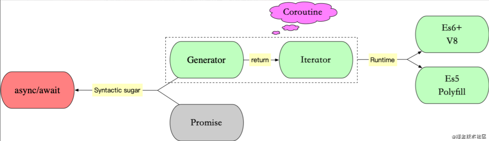

# async-await的原理

## 对比

```()
const gen = function* () {
  const f1 = yield readFile('/etc/fstab');
  const f2 = yield readFile('/etc/shells');
  console.log(f1.toString());
  console.log(f2.toString());
};

const asyncReadFile = async function () {
  const f1 = await readFile('/etc/fstab');
  const f2 = await readFile('/etc/shells');
  console.log(f1.toString());
  console.log(f2.toString());
};
```

async函数对 Generator 函数的改进，体现在以下四点。

### 内置执行器

Generator 函数的执行必须靠执行器，所以才有了co模块，而async函数自带执行器。也就是说，async函数的执行，与普通函数一模一样，只要一行。

```()
asyncReadFile();
```

上面的代码调用了asyncReadFile函数，然后它就会自动执行，输出最后结果。这完全不像 Generator 函数，需要调用next方法，或者用co模块，才能真正执行，得到最后结果。

### 更好的语义

### 更广的适用性

co模块约定，yield命令后面只能是 Thunk 函数或 Promise 对象，而async函数的await命令后面，可以是 Promise 对象和原始类型的值（数值、字符串和布尔值，但这时会自动转成立即 resolved 的 Promise 对象）。

### 返回值是 Promise

async函数的返回值是 Promise 对象，这比 Generator 函数的返回值是 Iterator 对象方便多了。你可以用then方法指定下一步的操作。

进一步说，async函数完全可以看作多个异步操作，包装成的一个 Promise 对象，而await命令就是内部then命令的语法糖。

## 理解

js 因为是单线程的,所以不可能完全等待之前代码结束之后再执行后续代码(同步),太浪费时间了,需要有一个机制,可以在需要等待执行结果之前先去做其他的事情,等请求有结果了,再插入当前空余时间节点去执行(异步),就像callback

实现异步的核心就是回调钩子，将 cb 作为参数传递给异步执行函数，当有了结果后在触发 cb.

当然回调函数的问题是会造成回调地狱,所以为了在写法上更加友好,es6推出了 Promise、Generator、Async/await,



首次将协程的概念引入 js，是协程的子集，不过由于不能指定让步的协程，只能让步给生成器(迭代器)的调用者，所以也称为非对称协程

而 Generator 又返回迭代器Iterator对象，

所以就得先讲一讲 Iterator,

而 Iterator 和 Generator 都属于协程，

终于找到源头了：协程

### 协程

> wiki：协程（英语：coroutine）是计算机程序的一类组件，推广了协作式多任务的子程序，允许执行被挂起与被恢复。相对子例程而言，协程更为一般和灵活，但在实践中使用没有子例程那样广泛。协程更适合于用来实现彼此熟悉的程序组件，如协作式多任务、异常处理、事件循环、迭代器、无限列表和管道
> 协程可以通过 yield（取其“让步”之义而非“出产”）来调用其它协程，接下来的每次协程被调用时,从协程上次 yield 返回的位置接着执行，通过 yield 方式转移执行权的协程之间不是调用者与被调用者的关系，而是彼此对称、平等的
> 协程是追求极限性能和优美的代码结构的产物
> 协程间的调用是逻辑上可控的，时序上确定的

协程是一种比线程更加轻量级的存在，是语言层级的构造，可看作一种形式的控制流,可以把协程看成是跑在线程上的任务，一个线程上可以存在多个协程，但是在线程上同时只能执行一个协程。

单核CPU场景中发展出来的概念，通过提供挂起和恢复接口，实现在单个CPU上交叉处理多个任务的并发功能。

那么如何理解 js 中的协程呢？

* js 公路只是单行道（主线程），但是有很多车道（辅助线程）都可以汇入车流（异步任务完成后回调进入主线程的任务队列）
* generator 把 js 公路变成了多车道（协程实现），但是同一时间只有一个车道上的车能开（依然单线程），不过可以自由变道（移交控制权）

### Iterator

Iterator 翻译过来就是**迭代器（遍历器）**让我们先来看看它的遍历过程(类似于单向链表)：

* 创建一个指针对象，指向当前数据结构的起始位置
* 第一次调用指针对象的 next 方法，将指针指向数据结构的第一个成员
* 第二次调用指针对象的 next 方法，将指针指向数据结构的第二个成员
* 不断的调用指针对象的 next 方法，直到它指向数据结构的结束位置(done)

一个对象要变成可迭代的，必须实现 @@iterator 方法，即对象（或它原型链上的某个对象）必须有一个名字是 Symbol.iterator 的属性（原生具有该属性的有：String、Array、TypedArray、Map 和 Set）可通过常量 Symbol.iterator 访问

### Generator

生成器对象是生成器函数（GeneratorFunction）返回的，它符合可迭代协议和迭代器协议，既是迭代器也是可迭代对象，可以调用 next 方法，但它不是函数，更不是构造函数

```()
function* name([param[, param[, ... param]]]) { statements }

// name：函数名
// param：参数
// statements：js 语句
```

总结一下 Generator 的本质，暂停，它会让程序执行到指定位置先暂停（yield），然后再启动（next），再暂停（yield），再启动（next），而这个暂停就很容易让它和异步操作产生联系，因为我们在处理异步时：开始异步处理（网络求情、IO 操作），然后暂停一下，等处理完了，再该干嘛干嘛。不过值得注意的是，js 是单线程的（又重复了三遍），异步还是异步，callback 还是 callback，不会因为 Generator 而有任何改变

#### 一个例子

自执行Generator函数模拟:

```()
function run(gen) {
  const g = gen();

  function next(data) {
    const res = g.next(data);
    // 深度递归，只要 `Generator` 函数还没执行到最后一步，`next` 函数就调用自身
    if (res.done) return res.value;
    res.value.then(function(data) {
      next(data);
    });
  }

  next();
}

run(function*() {
  const res1 = yield Promise.resolve({a: 1});
  console.log(res1);
  // { "a": 1 }
  const res2 = yield Promise.resolve({b: 2});
  console.log(res2);
  // { "b": 2 }
});
```

> 请注意,yield语法直接控制了其下所有代码的执行,不能简单理解为同步执行代码的从上到下
