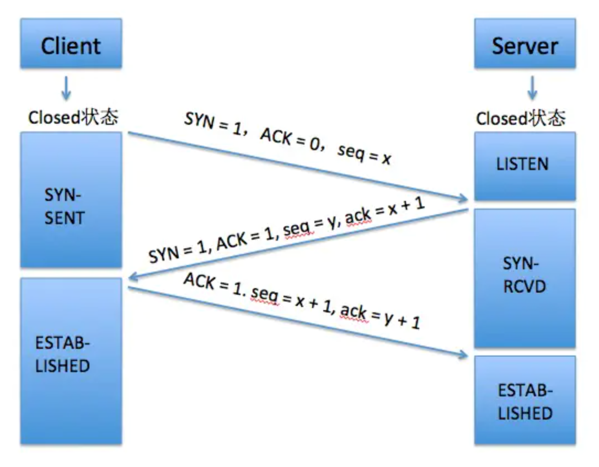
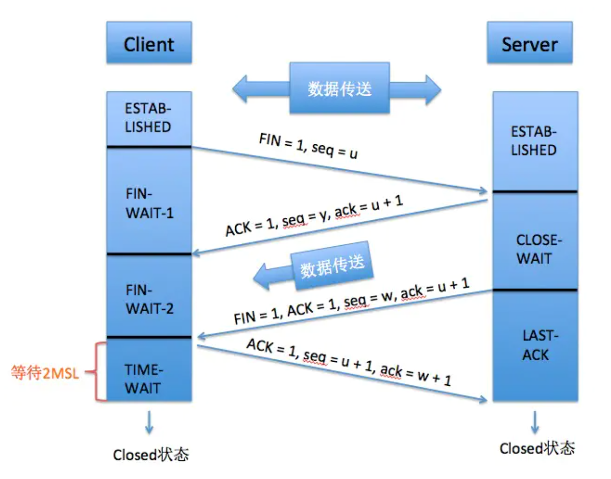

# 正文

- [正文](#正文)
  - [TCP/IP](#tcpip)
    - [为什么要三次握手、四次挥手](#为什么要三次握手四次挥手)
    - [TCP三次握手](#tcp三次握手)
    - [为什么握三次手，握两次或者四次行不行](#为什么握三次手握两次或者四次行不行)
      - [第一次握手](#第一次握手)
      - [第二次握手](#第二次握手)
      - [第三次握手](#第三次握手)
      - [结论](#结论)
  - [TCP四次挥手](#tcp四次挥手)
    - [为什么最后一次挥手，客户端还要进入一个TIME-WAIT状态](#为什么最后一次挥手客户端还要进入一个time-wait状态)

## TCP/IP

### 为什么要三次握手、四次挥手

TCP协议在传输数据的时候，客户端（Client）跟服务端（Server）会建立连接，然后把需要传输的文件进行分段，以及提供可靠传输和流量控制，在数据传输完成后，当前的会话也要断开连接，避免资源浪费。其实TCP的三次握手就是建立连接的过程，而四次挥手就是断开连接的过程。

### TCP三次握手

TCP协议还有一个特点就是面向字节流，它会把数据都分成一个个字节，然后进行分段传输，在分段传输的时候，每一段是由不同的字节序号组成的。

先介绍一下图中的一些字段：
SYN：同步序列号，是用来建立连接的握手信号。
ack：确认序号，当ACK为1时，ack有效，当ACK为0时，ack无效。
seq：序号。
ACK：确认序号有效。
FIN: 结束标志，用来表示断开连接。

最开始的时候，客户端和服务端都是Closed(关闭)状态，准备发送连接请求前，Server会进入LISTEN(监听)状态。

1. 第一次握手： 客户端(Client)会给服务端(Server)发送请求报文段，并指定同步序列号SYN = 1，ACK = 0， 初始序号为seq = x，（seq里面就是字节的序号），同时TCP的客户端进程进入SYN-SENT(同步已发送)状态。
2. 第二次握手： 服务端收到客户端发送的请求报文SYN后，会向客户端发送一个SYN报文作为应答，表示同意建立连接，同时指定了自己的SYN = 1， ACK = 1，还会向客户端发送seq = y，来表示自己的一个初始序号，同时也会告诉客户端下一次应该从哪开始发送的确认序号，由于客户端发送过来的初始序号seq = x, 所以确认序号ack = x + 1，这时，TCP的服务端进入SYN-RCVD(同步收到)状态。
3. 第三次握手： 客户端收到服务端的确认报文之后，会再次向服务端发送确认信息，表示已经收到。所以ACK = 1, seq = x + 1, ack = y + 1。TCP建立连接，客户端和服务器进入ESTAB-LISTEND(已建立连接状态)状态。

### 为什么握三次手，握两次或者四次行不行

通过上面的三次握手，我们可以很清楚的知道，每一步握手的目的是什么。

#### 第一次握手

客户端发送建立连接的请求报文段，服务端收到了，这样服务端能够得出客户端的发送和自己的接收是没有问题的。

#### 第二次握手

服务端也发送一个请求报文段，表示自己收到了来自客户端的建立连接请求报文段，同时客户端也收到服务器响应的这个报文段，这样客户端能够得出服务端的发送和自己的接收是没有问题的，但是服务端并不知道客户端的接收有没有问题(只是客户端自己知道)所以还需要第三次握手来告知服务端。

#### 第三次握手

客户端接着发送请求报文段，表示自己收到了服务端的确认信息，然后服务端也正常收到了。自此，握手结束，可以知道双方的发送和接收是正常的。

#### 结论

假如只握手了前两次，会造成什么样的后果呢？
客户端第一次向服务端发送了建立连接的请求报文段，有可能因为网络的原因滞留了，客户端就会认为这个请求失效了，会重新向服务端发送一个连接请求，然后服务器正常响应连接。在某个时间段，第一次发送的连接请求才到达了服务端，如果没有第三次握手确认，那么此时服务端会误认为客户端又发了一个新的连接请求，会再一次响应客户端，客户端收到响应请求，发现这个请求刚刚已经发过了，而且也收到了服务端的响应，就忽略这个请求，但此时的服务端却还一直等待客户端的响应，这样就会造成资源的浪费。

假如握手了四次，又会是什么样子呢？
第三次握手，服务端最后一次收到客户端的响应请求之后，如果此时进行第四次握手的话，那么应该是服务端接着去响应刚刚收到的这个请求，这个请求不管失败还是成功，意义都不大。因为三次握手之后，客户端和服务端都已经知道了双方的发送和接收是正常的，是可以进行数据传输的，就不需要再次发送确认请求了，而且完全可靠的通信协议也是不存在的。

## TCP四次挥手

第一次挥手: 客户端主动断开连接，向服务端发送FIN报文段，即连接释放报文段（FIN=1，序号seq=u），并且状态变为FIN-WAIT-1(终止等待1)。

第二次挥手: 服务端收到客户端的FIN报文段，响应请求，也向客户端发送一个ACK = 1，seq = y, ack = u + 1(三次握手阶段已经解释过seq和ack，没看懂的可以重新看一遍) 的报文段，来表示自己已经收到了客户端的断开连接的请求报文，同时将自己的状态变为CLOSE-WAIT(关闭等待)。

客户端收到第二次的挥手报文之后，也会将自身的状态变为FIN-WAIT-2(关闭等待)，此时客户端已经断开了对服务端的连接，也就是说，客户端不能再向服务端发送数据了，但是服务端并没有断开连接，它仍然要向客户端发送未发送完的数据，即TCP处于半关闭状态，这也是为什么要四次挥手的原因。

第三次挥手: 等待一段时间，当服务端将剩余数据发送完后，也会向客户端发送一个FIN = 1 的报文段，其中seq = w, ack = u + 1, ACK = 1，同时，自身进入LAST-ACK(最后确认)状态，来等待客户端的ACK。

第四次挥手: 客户端收到服务端的断开释放报文段FIN，同样对它进行响应，向服务段发送ACK = 1 ，seq = u + 1, ack = w + 1的报文段，并且自身进入TIME-WAIT状态，一段时间过后，服务端收到客户端的响应报文，将自身状态变为Closed，客户端等待TIME-WAIT时间过后，也将变为Closed状态。四次挥手完毕，客户端和服务端断开连接。

### 为什么最后一次挥手，客户端还要进入一个TIME-WAIT状态

如果客户端最后一次挥手发送的确认请求报文，服务端没有收到的话，服务端就会认为，是因为它自己发送的FIN报文段没有发送出去，导致客户端没有收到，客户端没有收到，就不会给它发送确认请求报文，于是，服务器会再次发送FIN报文段，所以有一个时长为2MSL的等待时间。

## HTTP/2

HTTP/2 是 HTTP/1.x 的扩展，而非替代。所以 HTTP 的语义不变，提供的功能不变，HTTP 方法、状态码、URL 和首部字段等这些核心概念也不变。
之所以要递增一个大版本到 2.0，主要是因为它改变了客户端与服务器之间交换数据的方式。HTTP 2.0 增加了新的二进制分帧数据层，而这一层并不兼容之前的 HTTP 1.x 服务器及客户端——是谓 2.0。

### HTTP/2 连接建立过程

现在的主流浏览器 HTTP/2 的实现都是基于 SSL/TLS 的，也就是说使用 HTTP/2 的网站都是 HTTPS 协议的，所以本文只讨论基于 SSL/TLS 的 HTTP/2 连接建立过程。
基于 SSL/TLS 的 HTTP/2 连接建立过程和 HTTPS 差不多。在 SSL/TLS 握手协商过程中，客户端在 ClientHello 消息中设置 ALPN（应用层协议协商）扩展来表明期望使用 HTTP/2 协议，服务器用同样的方式回复。通过这种方式，HTTP/2 在 SSL/TLS 握手协商过程中就建立起来了。

### HTTP/1.1 的问题

1. 队头阻塞
2. 低效的 TCP 利用
3. 臃肿的消息首部
4. 受限的优先级设置

### 二进制分帧层

HTTP/2 是基于帧的协议。采用分帧是为了将重要信息封装起来，让协议的解析方可以轻松阅读、解析并还原信息。
而 HTTP/1.1 是以文本分隔的。解析 HTTP/1.1 不需要什么高科技，但往往速度慢且容易出错。你需要不断地读入字节，直到遇到分隔符 CRLF 为止，同时还要考虑不守规矩的客户端，它只会发送 LF。
解析 HTTP/1.1 的请求或响应还会遇到以下问题：

一次只能处理一个请求或响应，完成之前不能停止解析。
无法预判解析需要多少内存。

HTTP/2 有了帧，处理协议的程序就能预先知道会收到什么，并且 HTTP/2 有表示帧长度的字段。

### 多路复用

在 HTTP/1.1 中，如果客户端想发送多个并行的请求，那么必须使用多个 TCP 连接。
而 HTTP/2 的二进制分帧层突破了这一限制，所有的请求和响应都在同一个 TCP 连接上发送：客户端和服务器把 HTTP 消息分解成多个帧，然后乱序发送，最后在另一端再根据流 ID 重新组合起来。
这个机制为 HTTP 带来了巨大的性能提升，因为：

可以并行交错地发送请求，请求之间互不影响；
可以并行交错地发送响应，响应之间互不干扰；
只使用一个连接即可并行发送多个请求和响应；
消除不必要的延迟，从而减少页面加载的时间；
不必再为绕过 HTTP 1.x 限制而多做很多工作；

### 优先级

把 HTTP 消息分解为很多独立的帧之后，就可以通过优化这些帧的交错和传输顺序，进一步提升性能。
通过 HEADERS 帧和 PRIORITY 帧，客户端可以明确地和服务器沟通它需要什么，以及它需要这些资源的顺序。具体来讲，服务器可以根据流的优先级，控制资源分配（CPU、内存、带宽），而在响应数据准备好之后，优先将最高优先级的帧发送给客户端。

### 流量控制

HTTP/2 为数据流和连接的流量控制提供了一个简单的机制：

* 流量控制基于每一跳进行，而非端到端的控制；
* 流量控制基于 WINDOW_UPDATE 帧进行，即接收方广播自己准备接收某个数据流的多少字节，以及对整个连接要接收多少字节；
* 流量控制窗口大小通过  WINDOW_UPDATE 帧更新，这个字段指定了流 ID 和窗口大小递增值；
* 流量控制有方向性，即接收方可能根据自己的情况为每个流乃至整个连接设置任意窗口大小；
* 流量控制可以由接收方禁用，包括针对个别的流和针对整个连接。

### 服务器推送

HTTP/2 新增的一个强大的新功能，就是服务器可以对一个客户端请求发送多个响应。换句话说，除了对最初请求的响应外，服务器还可以额外向客户端推送资源，而无需客户端明确地请求。

### 首部压缩

HTTP/1.1 存在的一个问题就是臃肿的首部，HTTP/2 对这一问题进行了改进，可以对首部进行压缩。 在一个 Web 页面中，一般都会包含大量的请求，而其中有很多请求的首部往往有很多重复的部分。
