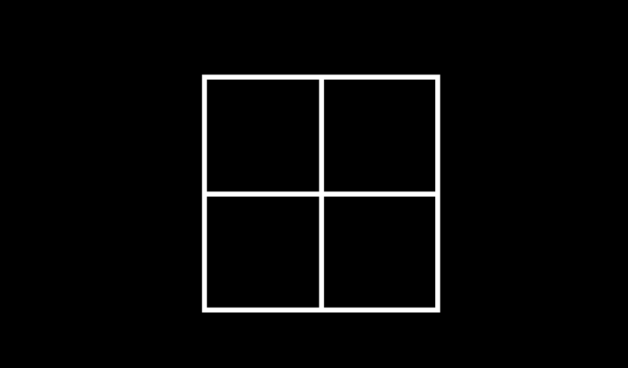

# 题目

有一张图片,如图所示:



## 代码

```()
<style>
body{
  width:100vw;
  height:100vh;
  display:flex;
  background-color:black;
}

.container{
  background-color:white; // 外扩
  overflow:hidden;
  padding-top:5px; // 上边距
  padding-left:5px; // 左边距
  margin:auto;
}

.item{
  width:30vmin; // 任意宽度即可,这里用了响应式单位
  box-sizing: border-box;
  float:left; // 浮动部分
  background:black; // 遮盖部分,所以是黑色
  margin-right:5px;
  margin-bottom:5px;
}

.item:nth-child(3){// 从第三个开始换行,所以需要清除浮动
  float:left;
  clear:both;
}

.a{
  width:100%;
  padding-bottom:100%;// 实现一个等于宽度的正方形
}
</style>

<body>
<div class="container">
    <div class="item">
      <div class="a"></div>
    </div>
    <div class="item">
      <div class="a"></div>
    </div>
    <div class="item">
      <div class="a"></div>
    </div>
    <div class="item">
      <div class="a"></div>
    </div>
</div>
</body>
```