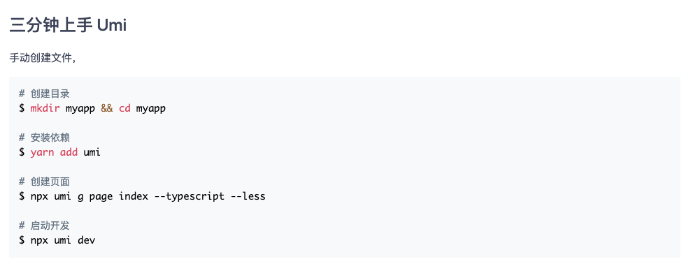
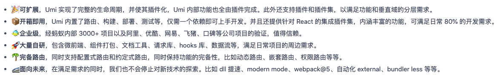
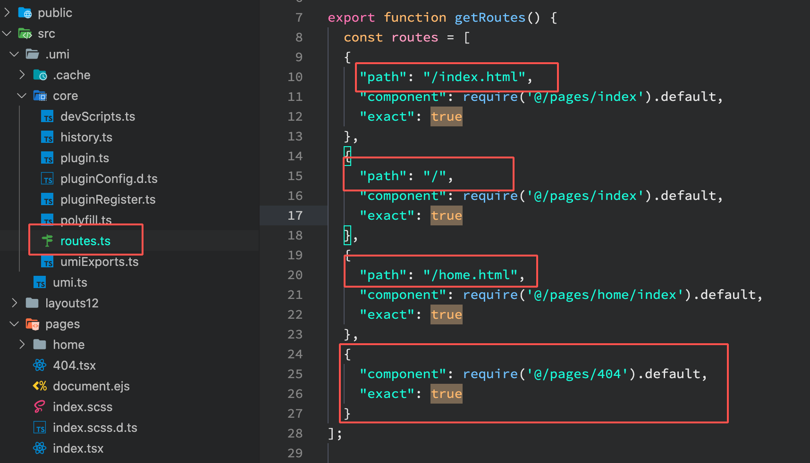
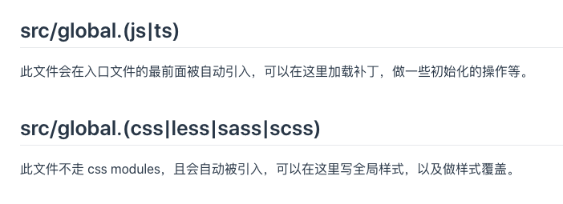
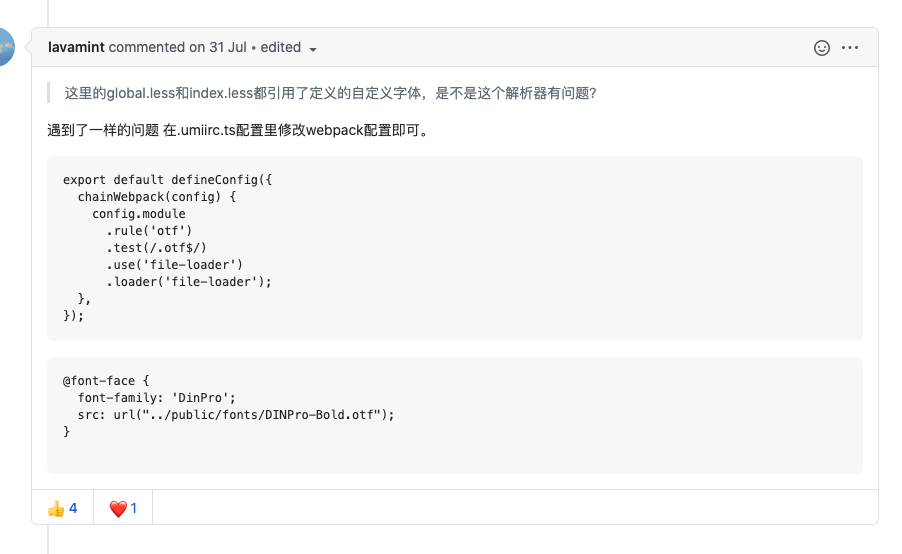

# 正文

> [umi官网](https://umijs.org/zh-CN),文章中所提到的例子地址为<https://github.com/leomYili/umiAppDemo>

## 简介

可以先通过官网的例子来大致看一下用法

也可以通过提供的脚手架甚至从 create-react-app(cra) 进行迁移.

那么与 cra 这类比较集成式的脚手架相比,umi有什么优势呢?

## umi的优势

如果让我来介绍的话,吸引我的点就是:

* 可以从外部以插件的形式,定制化修改webpack配置
* 可自定义的打包速度,包括了是否编译node_modules
* 虽然官方提供了很多的插件,但相比其他脚手架来说,可以卸载掉所有插件,甚至通过插件的形式可以打RN的包
* 完善的文档以及命令行工具还有环境变量,特别是插件文档,因为有足够的例子,可以做到循序渐进;之后如果涉及到微前端,组件打包都是很好的参考
* 还有一整套的解决方案,包括组件开发以及微前端
* 相比较完全自定义打包配置而言,umi确实都可以做到,而且还有插件规范,方便复用,这一点尤为重要
* 不仅仅是项目脚手架,也提供了组件脚手架,之前的[field-form](https://github.com/leomYili/blake-field-form)就是用[这个](https://github.com/umijs/father)打包的

当然也会有不足:

* 内置react-router,以及强制的routers配置,当使用其他的路由方案或者自定义路由时比较麻烦.
* 配置相较其他脚手架来说相对复杂,且因为很多参数无法直观的展示,所以需要实验之后才能了解用法,建议多看官方的 issues

## 与 Roadhog 区别

Roadhog 是一个包含 dev、build 和 test 的命令行工具，他基于 react-dev-utils，和 create-react-app 的体验保持一致。你可以想象他为可配置版的 create-react-app。

相比较来说,这更像 [react-app-rewird](https://github.com/timarney/react-app-rewired/blob/master/README_zh.md),所以与 umi 不是一个维度的方案

## 与 next.js 区别

这点官网上也有对比,而在我看来,最重要的也不是路由配置或者提供了dva(我也不怎么用dva),而是在两者相比功能类似的情况下,是否可扩展,且是否能够更多的避免配置一些常用类库对于研发效率来说才是最重要的,需要一个比较不错的落地方案,而不是看上去很美好,但实际用不到的功能,比如说ssr,中后台管理系统中很少会涉及这一方面,更不用说umi也提供了,甚至扩展体系中还提供了[Alita-基于umi的移动端框架](https://alitajs.com/intro)以及 [umi-plugin-qiankun](https://github.com/umijs/plugins/tree/master/packages/plugin-qiankun)、[umi-react-native](https://github.com/xuyuanxiang/umi-react-native)等.

### 自定义路由

其实也可以模仿官方的 [@umijs/plugin-layout](https://github.com/umijs/plugins/tree/master/packages/plugin-layout)

可以看到,两者都是递归遍历得到路由树,然后使用 `<Link to={route.path}>{route.breadcrumbName}</Link>` 做一层包裹用于跳转,达到自定义路由的目的

这里的情况适用于搭建中后台管理系统

#### routers

1. [getMatchMenu](https://github.com/leomYili/umiAppDemo)

#### mpa

这里需要注意,开启了mpa之后,就只能映射到一级路由,从 .umi 文件中可以看出

根路由规则改变了,请使用 XXX.html进行访问

### 分包

> 关于umi的分包,我理解分包是指把一个应用的部分拆出去,然后按需引入.拆的部分可以是路由、model、service、组件等等

这是个小众的需求,有几个场景会用上

1.一个场景是路由的分包

    一个站点会包含很多路由,然后一些场景下,比如业务项目,或者umi ui的插件化,或者项目太大了想要拆子系统,都会希望能把其中部分路由拆出去,交给其他人维护,然后拆出去的部分提供umd包进行对接

2.一个场景是组件的分包

    比如云凤蝶的场景,云凤蝶包含page和component,page是架子,由多个component组成,但包含哪些component是不确定的.所以做component的分包可以让page按需引用component.

#### 对接方式

1.npm依赖
2.umd包

各有优劣势.第一种应用场景有限;第二种可以在运行时(html)灵活组合,但是会有冗余问题.

#### 关于冗余

比如包a和包b都依赖antd,antd应该如何处理?

可以想到的方案有,

1. externals(webpack 支持外部引用)
2. 公用dll

但会带来额外的问题,

1.某些原本可以按需加载的包无法按需,比如antd,只能全量引入
2.版本同步以及升级问题,比如之后要升级antd@4,那么所有的分包都需要一起升级

### 问题汇总

目前umi 3.x问题还是会有一些的,主要是文档里记录不全

#### src/global.js与 src/global.css

#### 自定义字体

## 总结

回归到实际业务中,我们目前所遇到的问题是应用已经变成巨大的包了,虽然使用的技术栈依赖都比较新,但长此以往下去历史包袱显而易见的会比较沉重,更不用说各个模块里混杂的 flow.js TypeScript jsx 各种不兼容的写法了,因此解耦还是很有必要的.

umi可以作为先行试验方案,主要是为了将项目中打包相关的代码从主包中抽离出去,好处是这样打包器的优化就基本不受老项目的代码风格影响,在满足了之前的需求之后,还可以通过插件的形式,不断优化研发流程,提高开发效率,提高性能;且对于日常开发可以做到无感知升级.

使用现在的协同系统中的架构进行调试和打包与替换为umi做一个对比(相关例子请参考现场演示):

project | dev调试速度 | build包大小
---------|----------|---------
 heihu-web | 3.55 min | 50.5 MB
 umi-heihu-web | 1.12 min  | 23 MB

## 后记

也可以参考 [Alita-基于umi的移动端框架](https://alitajs.com/intro) 使用 Cordova 来达到跨平台的目的.成本比RN要小很多.

over!
